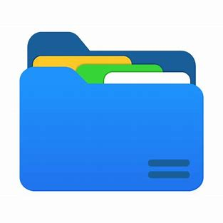

# File Organizer

A Java desktop application that creates backups of your files and automatically organizes them into categorized folders based on file extensions. Built with Swing GUI.



## Features

- **Automatic Organization**: Sorts files into logical categories (Images, Documents, Videos, etc.)
- **Intuitive GUI**: Clean Swing interface for easy operation
- **Batch Processing**: Handles large directories efficiently
- **Safe Operation**: Non-destructive - original files remain untouched

## Supported File Categories

| Category | Extensions |
|----------|-----------|
| Text | `.txt`, `.md`, `.rtf` |
| Document | `.pdf`, `.doc`, `.docx`, `.odt` |
| Spreadsheet | `.xls`, `.xlsx`, `.ods`, `.csv` |
| Presentation | `.ppt`, `.pptx`, `.odp` |
| Image | `.jpg`, `.jpeg`, `.png`, `.gif`, `.bmp`, `.svg`, `.webp` |
| Audio | `.mp3`, `.wav`, `.flac`, `.aac`, `.ogg` |
| Video | `.mp4`, `.mkv`, `.avi`, `.mov`, `.wmv`, `.webm` |
| Archive | `.zip`, `.rar`, `.7z`, `.tar`, `.gz`, `.bz2` |
| Executable | `.exe`, `.msi`, `.apk`, `.jar`, `.deb` |
| Data | `.json`, `.xml`, `.yaml`, `.sql` |
| Code | `.html`, `.css`, `.js`, `.java`, `.py`, `.c`, `.cpp`, `.go`, `.rs` |

## Requirements

- **Java 21+** (Download from [Oracle](https://www.oracle.com/java/technologies/downloads/) or [OpenJDK](https://openjdk.org/))
- **Operating System**: Windows, macOS, or Linux

## Quick Start

### Option 1: Download Release
1. Download the latest `FileManager.jar` from the [Releases](../../releases) page
2. Double-click the JAR file or run:
   ```bash
   java -jar FileManager.jar
   ```

### Option 2: Build from Source
1. Clone the repository:
   ```bash
   git clone https://github.com/yourusername/file-organizer.git
   cd file-organizer
   ```

2. Compile the project:
   ```bash
   javac -d bin src/module-info.java src/ie/app/com/*.java
   ```

3. Create the JAR file:
   ```bash
   jar --create --file FileManagerExe/FileManager.jar --main-class ie.app.com.Main -C bin/ .
   ```

4. Run the application:
   ```bash
   java -jar FileManagerExe/FileManager.jar
   ```

## How to Use

1. **Launch** the application
2. **Select Source Directory**: Choose the folder containing files to organize
3. **Select Destination Directory**: Choose where organized files should be saved
4. **Click "Run"**: Start the backup and organization process
5. **Done**: Check your destination folder for organized files


## Contributing

Contributions are welcome! Here's how you can help:

1. **Fork** the repository
2. **Create** a feature branch (`git checkout -b feature/amazing-feature`)
3. **Commit** your changes (`git commit -m 'Add amazing feature'`)
4. **Push** to the branch (`git push origin feature/amazing-feature`)
5. **Open** a Pull Request


## Roadmap

- [ ] Drag & drop support
- [ ] Progress bar for large operations
- [ ] Duplicate file detection
- [ ] Configuration file support
- [ ] Dark mode theme


##  License

This project is licensed under the MIT License - see the [LICENSE](LICENSE) file for details.

## Acknowledgments

- Built while learning Java and exploring the `Path` class
- Inspired by the need for better file organization tools
- Thanks to the Java community for excellent documentation
